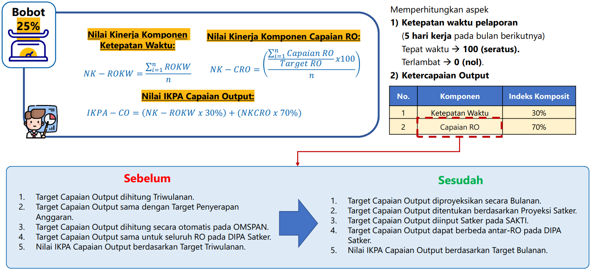

```{r setup, include=FALSE}
knitr::opts_chunk$set(echo = TRUE)
```

```{=html}
<style>
/* CSS langsung di dalam dokumen R Markdown */
.main-container {
  margin:0px 75px; /* Sesuaikan padding sesuai kebutuhan */
  max-width: 100%;
}
</style>
```
## Definisi

::: {style="text-align: justify;"}
**IKPA** adalah Indikator Kinerja Pelaksanaan Anggaran (IKPA) merupakan indikator yang penetapannya oleh Kementerian Keuangan selaku BUN untuk mengukur kualitas kinerja pelaksanaan anggaran belanja Kementerian Negara/Lembaga dari sisi kesesuaian terhadap perencanaan, efektivitas pelaksanaan anggaran, efisiensi pelaksanaan anggaran, dan kepatuhan terhadap regulasi.

Sesuai dengan Peraturan Direktur Jendral Perbendaharaan Nomor 5/PB/2022 tentang Petunjuk Teknis Penilaian Indikator Kinerja Pelaksanaan Anggaran (IKPA) Belanja Kementerian Negara/Lembaga terdapat beberapa aspek penilaian, salah satunya adalah **Aspek Kualitas Hasil Pelaksanaan Anggaran** yaitu Indikator kinerja Capaian Output

Bobot indikator kinerja Capaian Output dalam penilaian IPKA adalah sebesar 25% dan dengan proses bisnis Penilaian Indikator Kinerja adalah sebagai berikut
:::

{style="display: block; margin-left: auto; margin-right: auto;" width="65%"}

## Penjelasan Istilah

-   **Klasifikasi Rincian Output**, Kumpulan atas output (Rincian Output) K/L yang disusun dengan mengelompokkan atau mengklasifikasikan muatan keluaran (output) yang sejenis/serumpun berdasarkan sektor/bidang/jenis tertentu secara sistematis
-   **Rincian Output**, Keluaran (output) riil yang sangat spesifik yang dihasilkan oleh unit kerja K/L yang berfokus pada isu dan/atau lokasi tertentu serta berkaitan langsung dengan tugas dan fungsi unit kerja tersebut dalam mendukung pencapaian sasaran kegiatan yang ditetapkan.
-   **Target Progres Capaian Rincian Output (PCRO)**, Persentase yang menunjukkan target tingkat penyelesaian dari berbagai tahapan atau aktivitas yang dilakukan Satker dalam mencapai suatu output riil/spesifik berupa barang/jasa.
-   **Progres Capaian Rincian Output (PCRO)**, Persentase yang menunjukkan tingkat penyelesaian dari berbagai tahapan atau aktivitas yang dilakukan Satker dalam mencapai suatu output riil/spesifik berupa barang/jasa.
-   **Target Rincian Volume Rincian Output (TRVRO)**, Target keluaran (output) riil berupa jumlah barang atau jasa yang dihasilkan oleh Satker atas penggunaan anggarannya
-   **Rincian Volume Rincian Output**, Keluaran (output) riil berupa jumlah barang atau jasa yang dihasilkan oleh Satker atas penggunaan anggarannya

## Tabel Definisi Operasional RO Dit. SPO

```{r warning=FALSE, cache=FALSE, echo=FALSE}
reactable::reactable(df_do, fullWidth = TRUE, 
                     columns = list(
                       `Definisi Operasional` = colDef(minWidth = 300),
                       `Satuan` = colDef(minWidth = 150),
                       `Cara Perhitungan` = colDef(minWidth = 200)))
```

## Tabel Informasi Target PCRO dan RVRO
### Target RVRO
```{r warning=FALSE, cache=FALSE, echo=FALSE}
reactable::reactable(df_target %>% filter(`Jenis Target` %in% "Target RVRO Akumulasi"), fullWidth = FALSE, 
                     columns = list(
                       `Klasifikasi Rincian Output` = colDef(minWidth = 200),
                       `Rincian Output` = colDef(minWidth = 200)))
```
### Target PCRO
```{r warning=FALSE, cache=FALSE, echo=FALSE}
reactable::reactable(df_target %>% filter(`Jenis Target` %in% "Target PCRO Akumulasi"), fullWidth = FALSE, 
                     columns = list(
                       `Klasifikasi Rincian Output` = colDef(minWidth = 200),
                       `Rincian Output` = colDef(minWidth = 200)))
```

## Tabel Realisasi PCRO dan RVRO

```{r warning=FALSE, cache=FALSE, echo=FALSE}
reactable::reactable(df_gabungan, fullWidth = FALSE,height = 600, filterable = TRUE,
                     columns = list(
                       `Pagu Anggaran` = colDef(minWidth = 120,format = colFormat(prefix = "", separators = TRUE, digits = 0)),
                       `Realisasi Anggaran Akumulasi` = colDef(format = colFormat(prefix = "", separators = TRUE, digits = 0)),
                       `Klasifikasi Rincian Output` = colDef(minWidth = 200),
                       `Rincian Output` = colDef(minWidth = 200),
                       `Keterangan` = colDef(minWidth = 300)))
```

## Grafik TPCRO dengan PCRO untuk setiap Rincian Output

```{r fig.width = 12, fig.height = 7, fig.fullwidth = FALSE, warning=FALSE, message=FALSE, cache=FALSE, echo=FALSE, out.width='100%'}
p1
```

## Grafik TRVRO dengan RVRO untuk setiap Rincian Output

```{r fig.width = 12, fig.height = 7, fig.fullwidth = FALSE, warning=FALSE, message=FALSE, cache=FALSE, echo=FALSE, out.width='100%'}
p
```